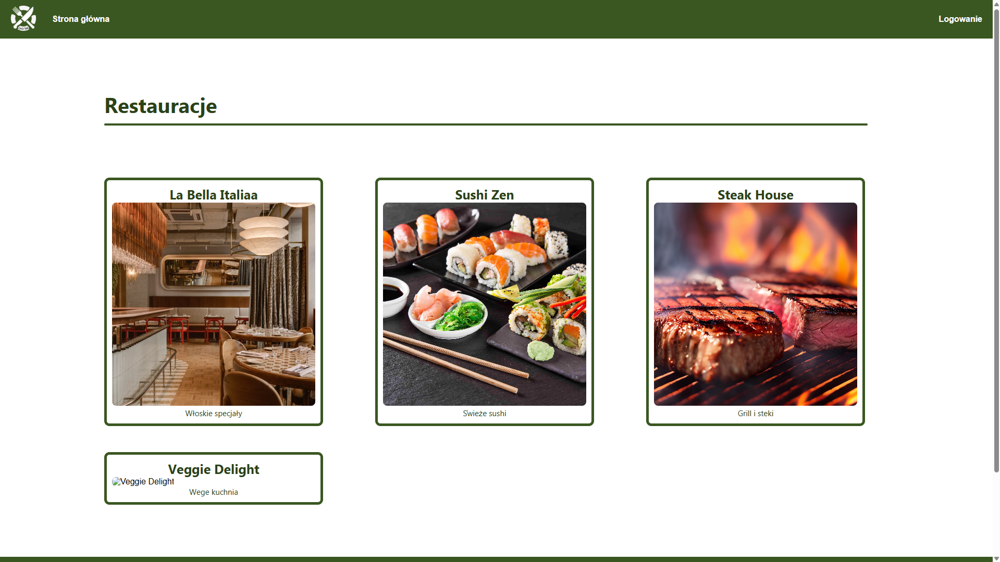
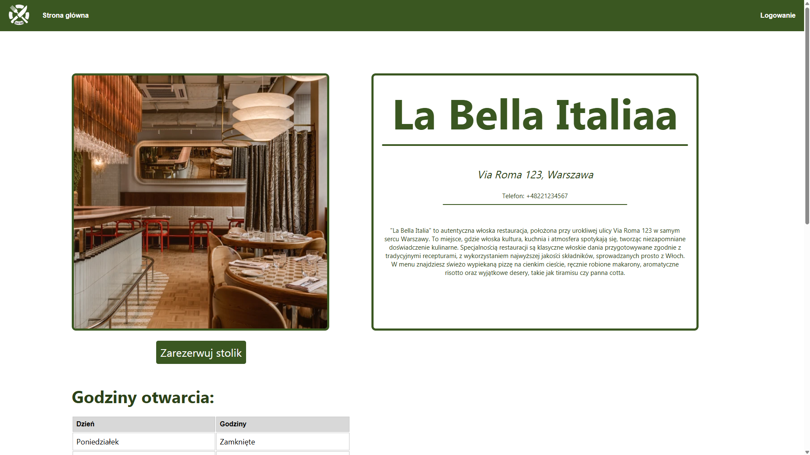
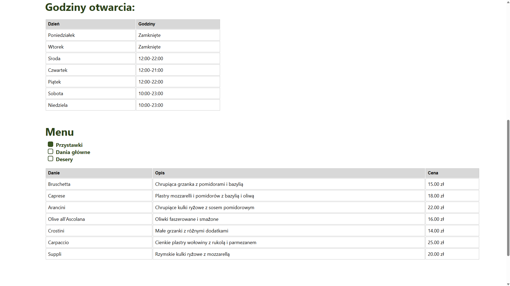
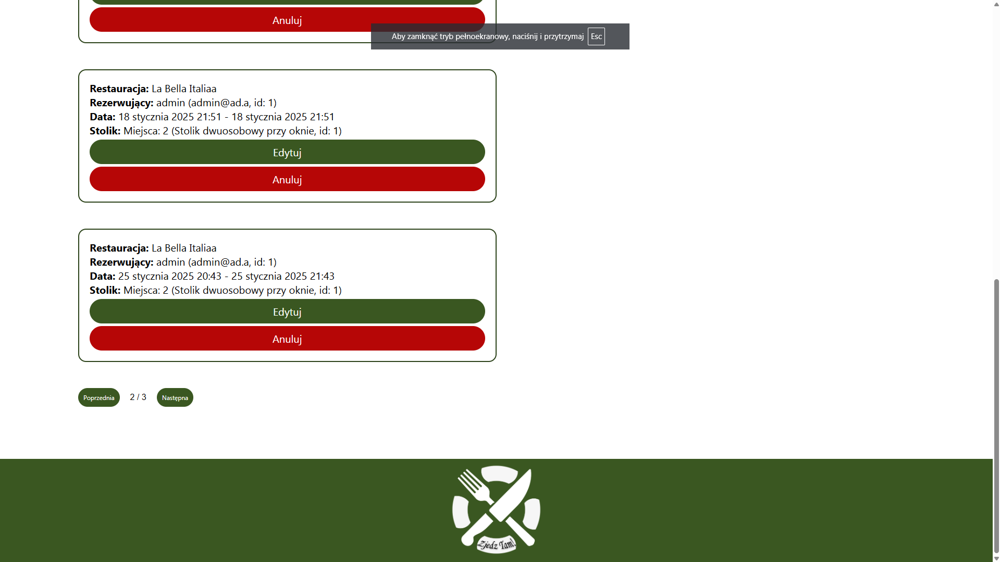

# 🍽️ Zjedz Tam!

**Zjedz Tam!** is a web application that enables users to book tables at restaurants.

This project was created to develop practical full-stack development skills and is part of my portfolio. The app includes functionality for both users and administrators (with role-based access), along with a backend, database, and API interface.

> **Note:** The user interface is currently available in **Polish** only.

---

## ✨ Main Features

### User
- Registration and login using JWT
- Browse available restaurants and view detailed information
- Book tables for a specific date and time
- Personal dashboard with reservation history
- Data validation (frontend + backend)
- Request authorization and middleware-protected routes

### Restaurant Administrator
- Manage reservations for their own restaurant (view, edit, cancel)
- Add and edit tables with assigned number of seats
- Create and update menus with categorized items
- Set opening hours for the restaurant
- Manage access – assign other users as restaurant co-admins

*A separate system administrator role exists with permissions to manage restaurants globally.*

---

## 📸 Screenshots

### User homepage
  
Users can browse the list of available restaurants with thumbnails, names, and brief descriptions.

---

### Restaurant details
  
Clicking a restaurant opens a full details page with description, address, and booking options.

---

### Menu and opening hours
  
Displays the restaurant's current menu (categorized) and opening hours.

---

### Booking form
  
The user selects a date, time, reservation duration, and an available table.

---

## Admin Views

The app supports two levels of administrative access:  
• **Restaurant Admin** – manages a specific venue  
• **System Admin** – manages all restaurants in the system

---

### System Admin – Restaurant management panel
  
Manage all restaurants: create, edit, delete, and assign access.

---

### Restaurant Admin – Restaurant panel
  
Manage local details, reservations, menu, and seating layout.

---

### Restaurant Admin – Menu & hours editor


---

### Restaurant Admin – Reservations view


---

### Restaurant Admin – Table editor


---

## 🛠️ Technologies

**Frontend:**
- React
- HTML / CSS
- JavaScript
- Context API
- Fetch API

**Backend:**
- Node.js + Express
- JWT (authentication)
- MySQL
- REST API

**Other:**
- bcrypt (password hashing)
- Local MySQL environment
- Postman (API testing)

---

## 📁 Project Structure

The project consists of three main parts:

- `frontend/` – React app (pages, components, styles, user context)
- `backend/` – Node.js + Express server (models, controllers, middleware, routes)
- `database/` – SQL files to create and populate the database, plus ERD

Additional:
- `screenshots/` – screenshots for documentation
- `README.md` – project description

---

## ⚙️ Running Locally

### Prerequisites

- Node.js (v16+)
- MySQL

---

### Step 1: Database Setup

1. Launch your MySQL server
2. Log in to your MySQL console
3. In the `database/` folder you'll find two SQL files:
   - `db_create.sql` – creates the database schema
   - `db_values.sql` – inserts sample data
4. Run both files in order:

```sql
-- First the structure
SOURCE /path/to/database/db_create.sql;

-- Then the sample data
SOURCE /path/to/database/db_values.sql;
```

Make sure the database name is `zjedz_tam`, or update it accordingly in the `.env` file.

---

### Step 2: Environment Configuration

>  **Note:** The `.env` file is included for convenience. It contains default settings for local development and is safe to use locally.
> 
####  backend/.env:

```
DB_HOST=localhost
DB_USER=root
DB_PASSWORD=admin
DB_NAME=zjedz_tam
DB_PORT=3306
PORT=8000
JWT_SECRET=sekretnysekret
```

---

###  Step 3: Installing Dependencies

**Backend:**
```bash
cd backend
npm i
```

**Frontend:**
```bash
cd ../frontend
npm i
```

---

###  Step 4: Running the Application

Start **backend:**
```bash
cd backend
node server
```

Start **frontend:**
```bash
cd ../frontend
npm start
```

The app will be available at: [http://localhost:3000](http://localhost:3000)

---

### Test Login Credentials

You can log in with the following test accounts:

1. **System Administrator**
   - Email: `admin@ad.a`
   - Password: `admin123`

2. **User (admin of "La Bella Italia" restaurant)**
   - Email: `user@us.u`
   - Password: `user123`

---

## 📊 Database Model

ERD schema file:

```
/database/db-model.png
```

---

## 📚 Future Improvements

- Review & rating system for restaurants
- Reservation notification system
- Filtering and searching by location, name, cuisine type, rating
- Map integration
- Extended role system (e.g., waiter/manager access)
- Password reset and account management
- Unit and integration tests

---

## 📫 Contact

- GitHub: [@s29418](https://github.com/s29418)
- Email: _kulasmikolaj00@gmail.com_
