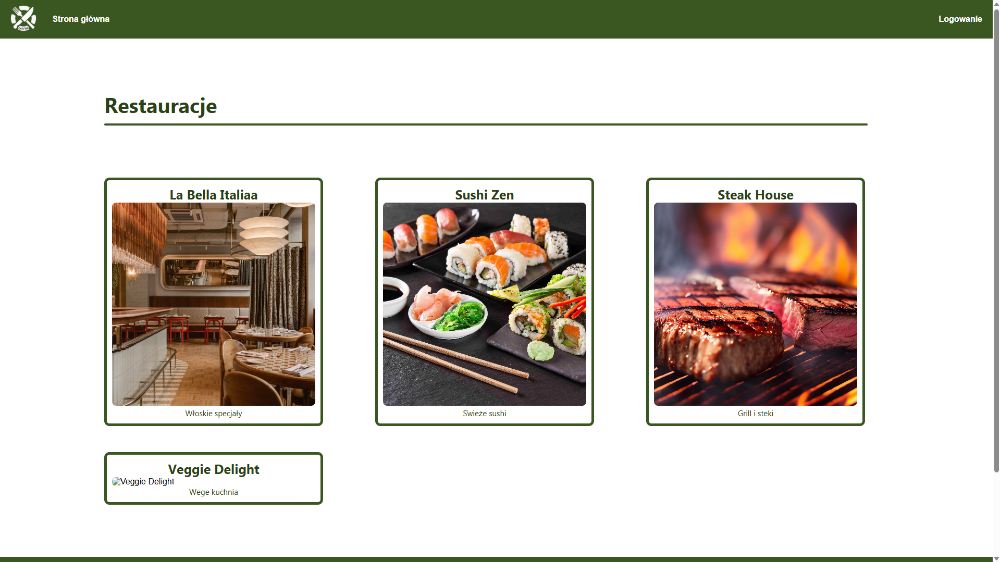
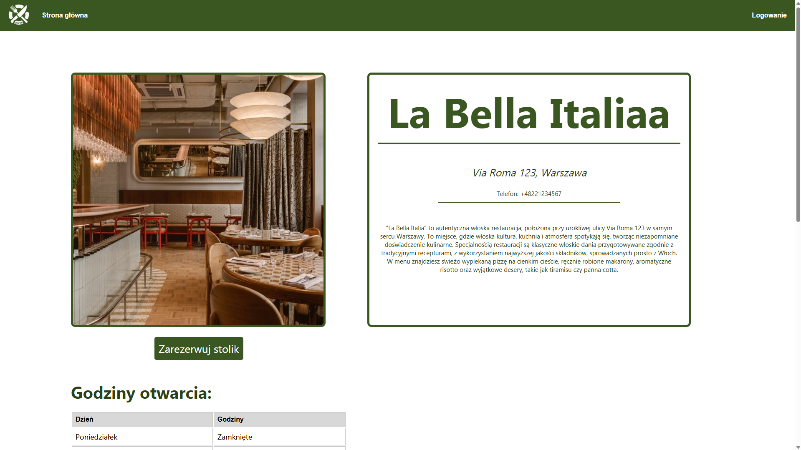
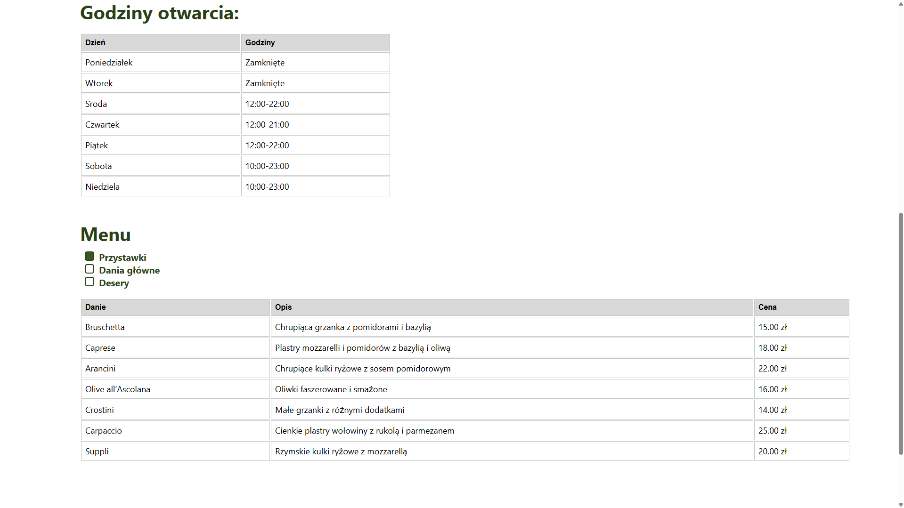
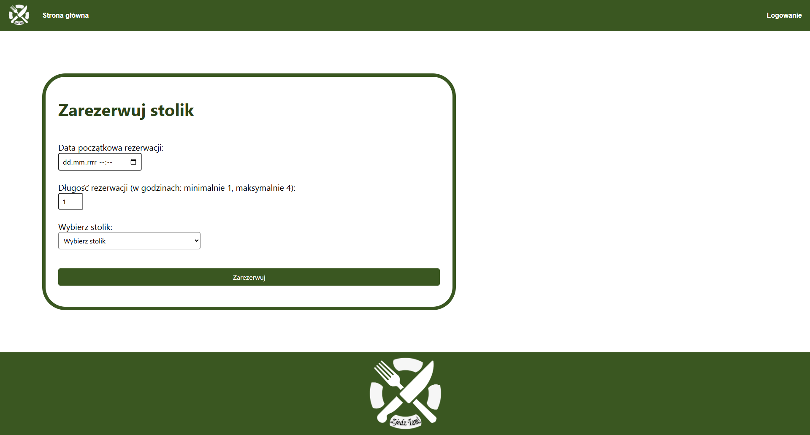
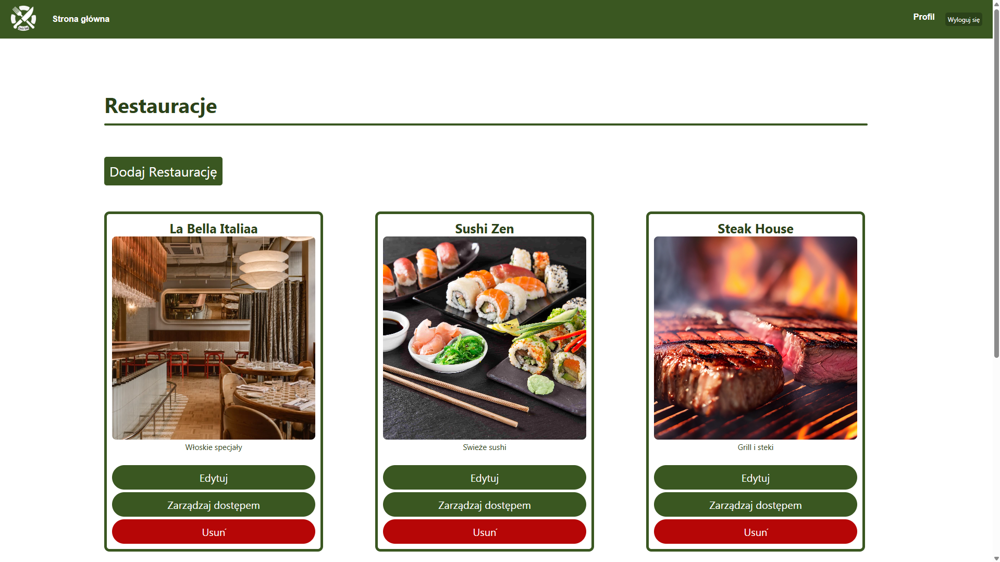
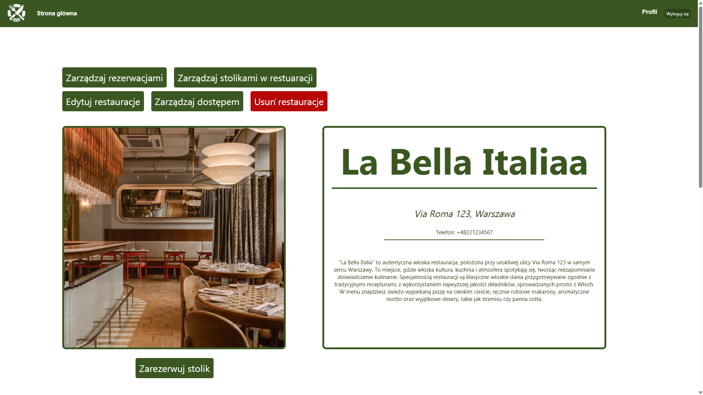
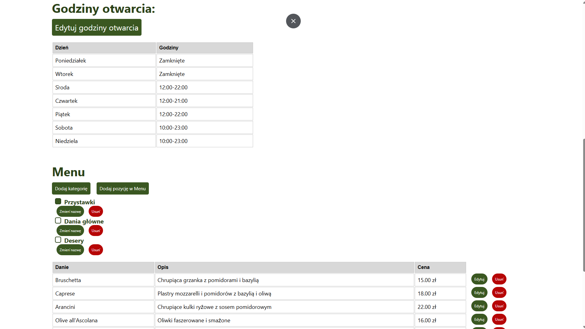
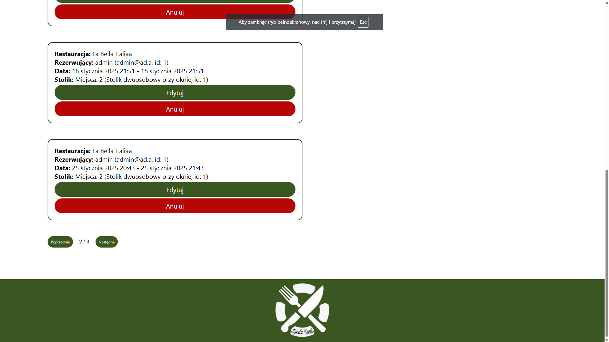
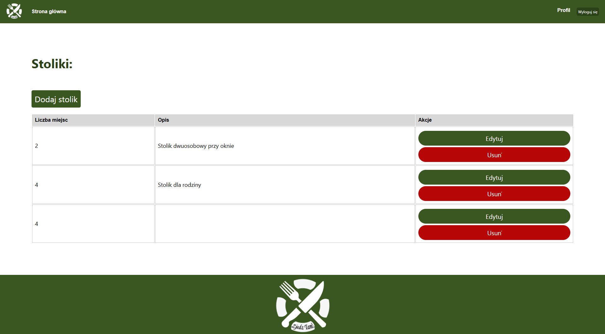

# 🍽️ Zjedz Tam!

**Zjedz Tam!** to aplikacja webowa umożliwiająca rezerwację stolików w restauracjach.

Projekt został stworzony z myślą o rozwijaniu praktycznych umiejętności full-stack i stanowi element mojego portfolio. Aplikacja zawiera funkcjonalności zarówno dla użytkowników, jak i administratorów (z podziałem na role), a także backend z bazą danych i interfejsem API.

---

## ✨ Główne funkcjonalności

### Użytkownik
- Rejestracja i logowanie z użyciem JWT
- Przegląd dostępnych restauracji i szczegółowych informacji
- Rezerwacja stolika na konkretną datę i godzinę
- Panel użytkownika z historią rezerwacji
- Walidacja danych (frontend + backend)
- Autoryzacja żądań do API i middleware chroniący zasoby

### Administrator restauracji
- Zarządzanie rezerwacjami w swojej restauracji (podgląd, edycja, anulowanie)
- Dodawanie i edytowanie stolików z przypisaną liczbą miejsc
- Tworzenie i edycja menu z podziałem na kategorie
- Ustalanie godzin otwarcia lokalu
- Zarządzanie dostępem – możliwość przypisania innych użytkowników jako współadminów lokalu

*W aplikacji istnieje także rola administratora systemowego z uprawnieniami do tworzenia i usuwania restauracji oraz zarządzania dostępami.*


---

## 📸 Zrzuty ekranu

### Strona główna użytkownika
  
Użytkownik widzi listę dostępnych restauracji z miniaturą, nazwą i krótkim opisem.

---

### Szczegóły restauracji
  
Kliknięcie w restaurację prowadzi do strony z pełnym opisem, adresem i przyciskiem do rezerwacji.

---

### Widok menu i godzin otwarcia
  
Informacje o godzinach otwarcia i aktualne menu podzielone na kategorie.

---

### Formularz rezerwacji
  
Użytkownik wybiera datę, godzinę, czas trwania rezerwacji oraz dostępny stolik.

---

## Widoki administracyjne

Aplikacja zawiera dwa poziomy uprawnień administracyjnych:  
• **Admin restauracji** – zarządza pojedynczym lokalem  
• **Admin systemu** – zarządza wszystkimi restauracjami

---

### Admin systemu – panel zarządzania restauracjami
  
Zarządzanie wszystkimi restauracjami w systemie: dodawanie, edycja, zarządzanie dostępem.

---

###  Admin restauracji – panel restauracji
  
Możliwość edycji danych lokalu, zarządzania stolikami, rezerwacjami i menu.

---

###  Admin restauracji – edycja godzin i menu


---

###  Admin restauracji – widok rezerwacji


---

###  Admin restauracji – edycja stolików


---

## 🛠️ Technologie

**Frontend:**
- React
- HTML / CSS
- JavaScript
- Context API
- Fetch API

**Backend:**
- Node.js + Express
- JWT (autoryzacja)
- MySQL
- REST API

**Inne:**
- bcrypt (hashowanie haseł)
- środowisko lokalne (MySQL)
- Postman (testowanie API)

---

## 📁 Struktura projektu

Projekt jest podzielony na trzy główne części:

- `frontend/` - aplikacja React (strony, komponenty, style, kontekst użytkownika)
- `backend/` - serwer Node.js + Express (modele, kontrolery, middleware, routes)
- `database/` - pliki SQL do utworzenia i zapełnienia bazy danych, model ERD

Dodatkowo:
- `screenshots/` - zrzuty ekranu do dokumentacji
- `README.md` - plik z opisem projektu

---

## ⚙️ Konfiguracja i uruchomienie projektu lokalnie

###  Wymagania wstępne

- Node.js (v16+)
- MySQL

---

###  Krok 1: Utworzenie bazy danych

1. Uruchom lokalny serwer MySQL
2. Zaloguj się do MySQL.
3. W katalogu `database/` znajdują się 2 pliki SQL:
   - `db_create.sql` – tworzy strukturę bazy danych
   - `db_values.sql` – wstawia dane przykładowe
4. Wykonaj te pliki w kolejności:

```sql
-- Najpierw struktura
SOURCE /ścieżka/do/database/db_create.sql;

-- Następnie dane przykładowe
SOURCE /ścieżka/do/database/db_values.sql;
```

 Uwaga: upewnij się, że masz utworzoną bazę danych `zjedz_tam` lub zmodyfikuj nazwę bazy w pliku `.env`.

---

### Krok 2: Konfiguracja środowiska

>  **Uwaga:** Plik `.env` został dołączony do repozytorium dla wygody testowania aplikacji lokalnie. Zawiera domyślne dane i może być bezpiecznie używany w środowisku lokalnym.

####  backend/.env:

```
DB_HOST=localhost
DB_USER=root
DB_PASSWORD=admin
DB_NAME=zjedz_tam
DB_PORT=3306
PORT=8000
JWT_SECRET=sekretnysekret
```

---

###  Krok 3: Instalacja zależności

**Backend:**
Przejdź do folderu backend i zainstaluj zależności
```bash
cd backend
npm i
```

**Frontend:**
Przejdź do folderu frontend i zainstaluj zależności
```bash
cd ../frontend
npm i
```

---

###  Krok 4: Uruchomienie aplikacji

Uruchom **backend:**
```bash
cd backend
node server
```

Uruchom **frontend:**
```bash
cd ../frontend
npm start
```

Aplikacja będzie dostępna pod adresem: [http://localhost:3000](http://localhost:3000)

---

### Dane testowe do logowania

Do przetestowania aplikacji możesz użyć gotowych kont:

1. **Administrator systemu**
   - Login: `admin@ad.a`
   - Hasło: `admin123`

2. **Użytkownik (admin restauracji „La Bella Italia”)**
   - Login: `user@us.u`
   - Hasło: `user123`

---

## 📊 Model bazy danych

Schemat ERD znajduje się w pliku:

```
/database/db-model.png
```

---

## 📚 Plany rozwoju

- System recenzji i oceniania restauracji
- System powiadomień o rezerwacjach
- Filtrowanie i wyszukiwanie po lokalizacji, nazwie, typie kuchni, ocenie
- Integracja z mapą
- Rozszerzony system ról (np. kelner/manager z ograniczonym dostępem)
- Resetowanie hasła i zarządzanie kontem
- Dodanie testów jednostkowych i integracyjnych

---

## 📫 Kontakt

- GitHub: [@s29418](https://github.com/s29418)
- Email: _kulasmikolaj00@gmail.com_
- 